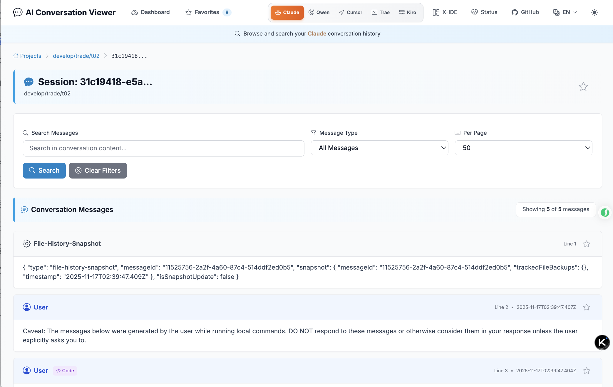
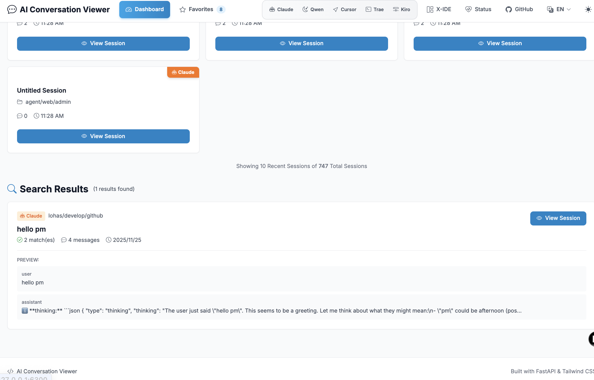
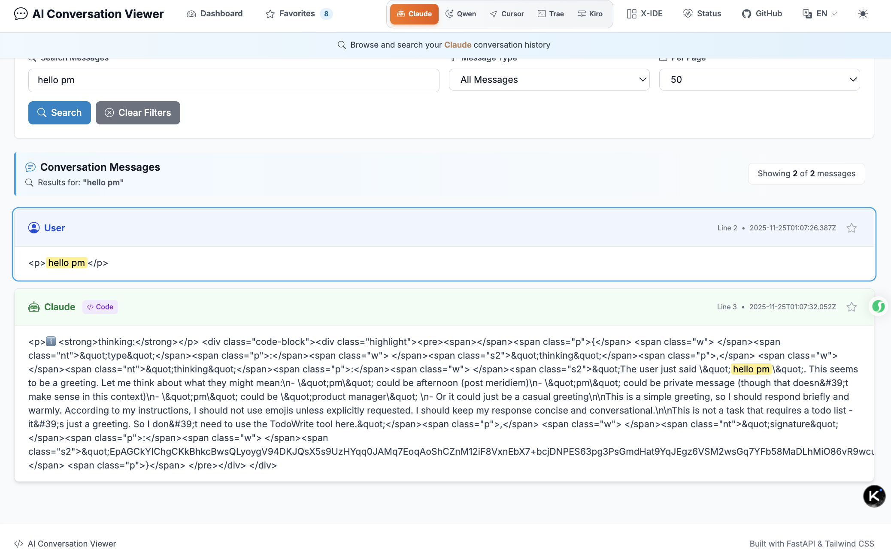
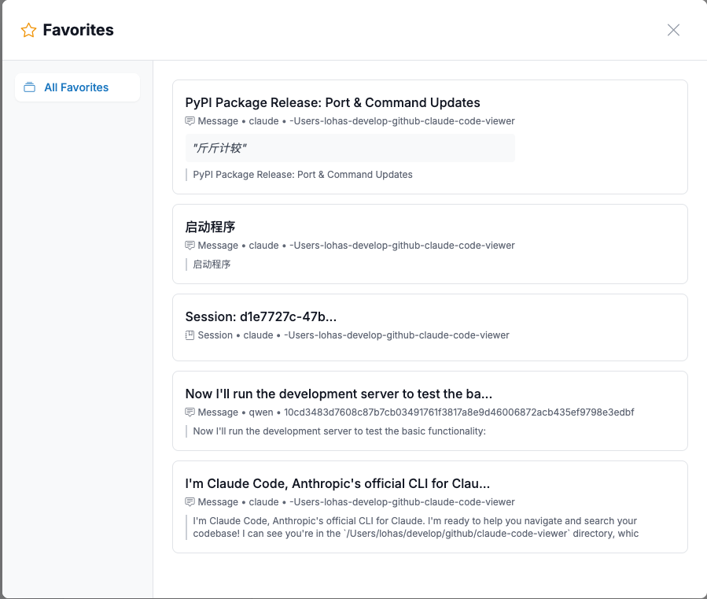
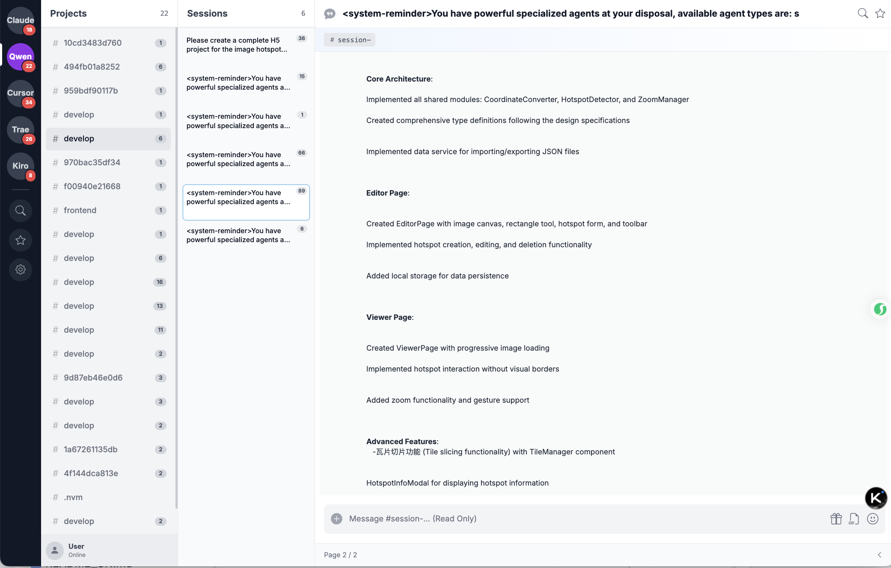

# AI Conversation Viewer 🔍

A beautiful, unified web interface for browsing and searching your AI conversation history across multiple platforms.


## ✨ Features

- 🤖 **Multi-IDE Sources** — Claude, Qwen, and Cursor/Trae/Kiro views with quick switcher
- 🔎 **Global & Scoped Search** — Search across all IDEs or within a session, with term highlighting
- 📁 **Project & Session Browsing** — Grouped by date with activity timeline and rich metadata
- 💻 **Markdown + Code Highlight** — Pygments-driven fenced code rendering and inline code styling
- 🧩 **Tool Use Visualization** — Structured tool calls rendered with readable params and outputs
- 🧾 **Diff Viewer for Edits** — Inline unified diff for Edit tool results with added/removed lines
- 🎛️ **Filters & Pagination** — Filter by role (User/Assistant/Summary), page size, and paginate large threads
- 🎨 **Modern UX** — Dark/light theme toggle, responsive layout, copy buttons on code blocks
- 🌍 **Internationalization** — Language switcher (English/中文) with consistent UI labels
- 📈 **Dashboard & Stats** — Global statistics cards and recent sessions across all sources

### Feature Details

- Multi-IDE support
  - Toggle views for `Claude`/`Qwen`/`Cursor`/`Trae`/`Kiro` directly from the header
  - Default data paths are auto-detected; override via environment variables:
    - `CLAUDE_PROJECTS_PATH`, `QWEN_PROJECTS_PATH`, `CURSOR_WORKSPACE_STORAGE_PATH`, `TRAE_WORKSPACE_STORAGE_PATH`, `KIRO_WORKSPACE_STORAGE_PATH`

- Project and session browsing
  - Projects listed with session counts, modified time, and display names derived from workspace metadata
  - Sessions show message count, size, modified time, and extracted title; timeline view for recent activity

- Conversation viewer
  - Markdown rendering with syntax highlighting for fenced blocks and inline code
  - Search within a conversation with keyword highlighting; filter by `user`/`assistant`/`summary`
  - Large results are paginated with quick controls; long tool outputs are safely truncated when needed
  - Tool calls are rendered in human-friendly format, including parameters and results
  - Edit tool results include an inline unified diff with line numbers and add/remove markers

- Global dashboard and search
  - Global search across all IDEs with previews and quick navigation to sessions
  - Statistics cards per IDE: project/session counts and availability, plus recent sessions listing

- Internationalization and theming
  - Language toggle via cookie; fully localized UI labels in English/Chinese
  - Theme toggle with persisted dark/light mode; mobile-responsive layout

- Health and diagnostics
  - `/health` endpoint surfaces counts and paths for each IDE store to aid setup and troubleshooting

### Favorites & Annotations

- Save sessions and individual messages to a persistent favorites store
  - Click the star button on a session header or per-message row to add to favorites
  - Open the Favorites page from the header to browse, filter, edit, and remove
- Storage
  - Persisted in SQLite at `~/.aicode-viewer/favorites.db`
  - Includes tags, annotation text, and lightweight content preview
- Filters and stats
  - Filter favorites by `type` (session/message), IDE `view`, `tag`, and text `search`
  - Favorites statistics: totals by type and IDE, plus top tags

Implementation references
- Favorites DB: `claude_viewer/db/favorites_db.py`
- Favorites UI: `claude_viewer/templates/favorites.html`, conversation star buttons in `claude_viewer/templates/conversation.html`

## 🚀 Quick Start

### Installation

```bash
pip install ai-coder-viewer
```

### Usage

```bash
# Start with default settings (looks for ~/.claude/projects)
aicode-viewer

# Custom Claude projects path
aicode-viewer --projects-path /path/to/your/claude/projects

# Custom port
aicode-viewer --port 8080

# Accessible from other machines
aicode-viewer --host 0.0.0.0 --port 3000
```

Then open your browser to: `http://localhost:6300`

## ⚡ Performance Optimization

The system includes built-in performance optimizations for faster response times:

### Features
- **Memory Caching**: Multi-level cache system (LRU + TTL) for projects, sessions, and conversations
- **Database Optimization**: SQLite with WAL mode, 64MB cache, and 9 optimized indexes
- **Smart Caching**: Automatic cache expiration with configurable TTL
- **Cache Management**: API endpoints for monitoring and clearing cache

### Performance Improvements
- **10x faster** project list loading (~500ms → ~50ms)
- **10x faster** session list loading (~300ms → ~30ms)
- **10x faster** conversation loading (~800ms → ~80ms)
- **10x faster** search operations (~1000ms → ~100ms)

### Cache Management

```bash
# View cache statistics
curl http://localhost:6300/api/cache/stats

# Clear all caches
curl -X POST http://localhost:6300/api/cache/clear?cache_type=all

# Clear specific cache
curl -X POST http://localhost:6300/api/cache/clear?cache_type=projects
```

### Performance Testing

```bash
# Install test dependencies
pip install tabulate

# Run performance tests
python test_performance.py
```

For detailed information, see:
- [Performance Optimization Guide](PERFORMANCE_OPTIMIZATION.md)
- [Quick Start Guide](QUICK_START_OPTIMIZATION.md)
- [Optimization Summary](OPTIMIZATION_SUMMARY.md)

## 📸 Screenshots

### Main Dashboard - Multi-IDE Navigation
Browse and navigate across multiple AI platforms including Claude, Qwen, Cursor, Trae, and Kiro. Real-time viewing of conversation history from all supported IDEs with quick platform switcher.


### Claude Conversation Viewer
Real-time conversation viewing with syntax highlighting, markdown rendering, and tool use visualization. View detailed conversation history with proper formatting and code highlighting.



### Global Search Interface
Powerful search functionality across all conversations and platforms. Search globally with instant results and quick navigation to any session.



### Search Results Detail
Detailed search results with context highlighting and preview. Navigate through search results efficiently with keyword highlighting.



### Favorites Management
Save and manage your favorite conversations and messages. Organize with tags, add annotations, and filter by IDE platform or type.



### X-IDE Mode
Advanced X-IDE mode with powerful features for enhanced productivity. Experience the next level of AI conversation management.



## 🛠️ Command Line Options

```bash
aicode-viewer --help
```

**Available options:**
- `--projects-path` - Path to Claude projects directory (default: `~/.claude/projects`)
- `--host` - Host to bind the server (default: `127.0.0.1`)
- `--port` - Port to run on (default: `6300`)
- `--version` - Show version information

## 📁 How It Works

AI conversation platforms store conversation history in JSONL files. This tool:

1. **Scans** your AI projects directory (Claude: `~/.claude/projects/`, Qwen: local storage)
2. **Parses** JSONL conversation files from multiple AI platforms
3. **Presents** them in a unified, beautiful web interface
4. **Enables** powerful search and filtering across all conversations
5. **Supports** multi-language UI for international users

## 🔧 Development

### Local Development

```bash
git clone https://github.com/lohasle/AI-Conversation-Viewer
cd AI-Conversation-Viewer
pip install -e .
aicode-viewer
```

#### Run with reload

```bash
uvicorn claude_viewer.main:app --reload --host 127.0.0.1 --port 6300
```

#### Configure data paths

- `CLAUDE_PROJECTS_PATH` — Claude project directory
- `QWEN_PROJECTS_PATH` — Qwen storage directory
- `CURSOR_WORKSPACE_STORAGE_PATH` — Cursor workspace storage
- `TRAE_WORKSPACE_STORAGE_PATH` — Trae workspace storage
- `KIRO_WORKSPACE_STORAGE_PATH` — Kiro workspace storage

Example:

```bash
export CLAUDE_PROJECTS_PATH=~/.claude/projects
export QWEN_PROJECTS_PATH=~/.qwen/tmp
aicode-viewer --port 6300
```

#### Develop without install

```bash
python -m uvicorn claude_viewer.main:app --reload
```

### Project Structure

```
claude-code-viewer/
├── claude_viewer/                 # Python package
│   ├── main.py                    # FastAPI application
│   ├── cli.py                     # Command line interface
│   ├── i18n.py                    # UI translations
│   ├── db/                        # Favorites SQLite (CRUD, tags, stats)
│   ├── utils/                     # Parsers and helpers (Claude/Qwen/etc.)
│   ├── templates/                 # Jinja2 templates (dashboard, project, conversation, favorites)
│   └── static/                    # Frontend assets (CSS/JS)
├── img/                           # Screenshots used in README
├── pyproject.toml                 # Packaging metadata (preferred)
├── setup.py                       # Legacy packaging metadata
├── MANIFEST.in                    # Package data inclusion rules
├── LICENSE                        # Apache 2.0 license
├── README.md / README_CN.md       # Documentation (English/Chinese)
├── QWEN.md                        # Qwen-specific notes
├── build_and_upload.sh            # Publishing helper script
└── .github/workflows/ci.yml       # CI pipeline
```

## 🤝 Contributing

Contributions welcome! Please:

1. **Fork** the repository
2. **Create** a feature branch (`git checkout -b feature/amazing-feature`)
3. **Commit** your changes (`git commit -m 'Add amazing feature'`)
4. **Push** to the branch (`git push origin feature/amazing-feature`)
5. **Open** a Pull Request

### Development Setup

```bash
git clone <your-fork>
cd claude-code-viewer
pip install -e ".[dev]"
```

## 🤖 Supported AI Platforms

Currently supports:
- **Claude Code** — Anthropic's official CLI for Claude
- **Qwen (通义千问)** — Alibaba Cloud's AI assistant
- **Cursor** — AI coding IDE workspace sessions
- **Trae** — AI coding IDE workspace sessions
- **Kiro** — AI coding IDE workspace sessions

More platforms coming soon!

## 📋 Requirements

- **Python 3.8+**
- **AI Platform** (Claude Code, Qwen, or other supported platforms)
- **Modern web browser** (Chrome, Firefox, Safari, Edge)

## 🐛 Troubleshooting

### "Projects path does not exist"
Make sure Claude Code has been used and has created conversation files. The default path is `~/.claude/projects`.

### "No JSONL files found"
Ensure you have used Claude Code and it has generated conversation history. Try specifying a custom path with `--projects-path`.

### Port already in use
Use a different port: `aicode-viewer --port 8080`

## 📄 License

Apache 2.0 License - see [LICENSE](LICENSE) file for details.

## 🙏 Acknowledgments

- Built with [FastAPI](https://fastapi.tiangolo.com/) and [Bootstrap](https://getbootstrap.com/)
- Syntax highlighting by [Pygments](https://pygments.org/)
- Created for the AI development community

## 📊 Highlights

- 🎯 **Zero configuration** - Works out of the box for most users
- ⚡ **Fast startup** - Sub-second launch time
- 🔍 **Full-text search** - Search across all conversations instantly
- 📱 **Mobile responsive** - Works seamlessly on all devices
- 🌍 **Multi-language** - English and Chinese UI support
- 🤖 **Multi-platform** - Support for multiple AI platforms

## 🗺️ Roadmap

- [ ] Support for more AI platforms (Gemini, etc.)
- [ ] Export conversations to various formats (PDF, Markdown, HTML)
- [ ] Advanced filtering and tagging system
- [ ] Conversation analytics and statistics
- [ ] Real-time conversation monitoring
- [ ] Continue conversations directly via Web interface
- [ ] UI overhaul with IM-style messaging interface
 

---

**Made with ❤️ for the AI development community**

[Report Issues](https://github.com/lohasle/AI-Conversation-Viewer/issues) • [Feature Requests](https://github.com/lohasle/AI-Conversation-Viewer/issues/new)  • [中文文档](README_CN.md)
