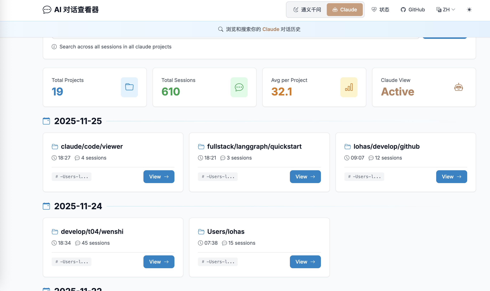
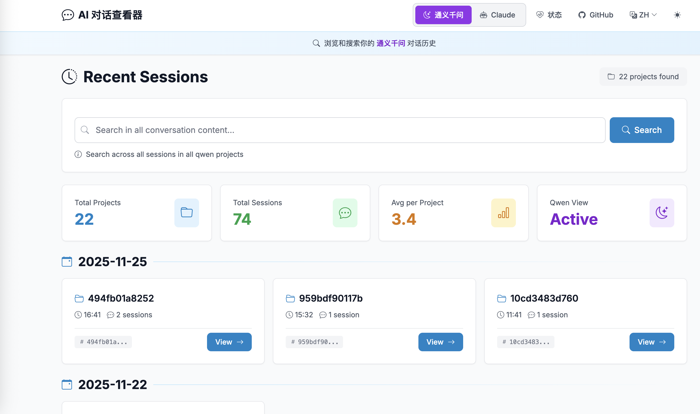
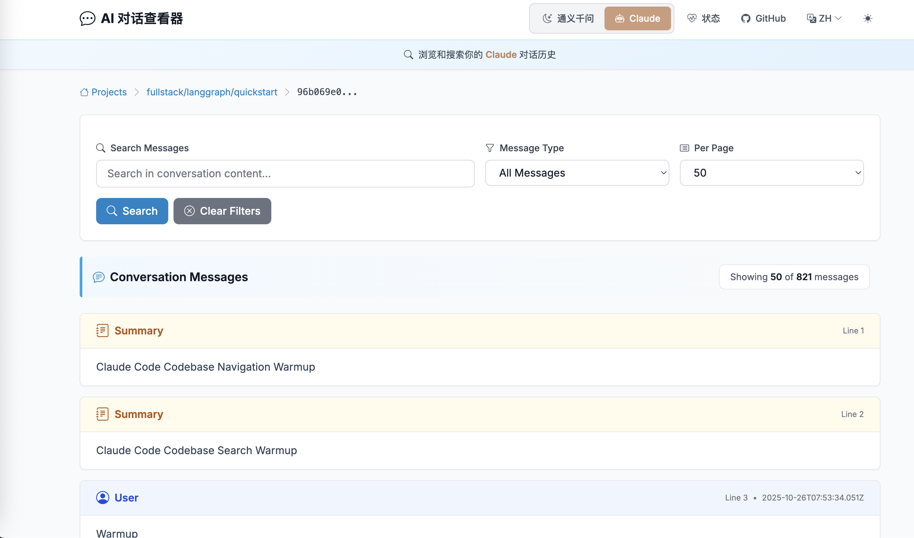
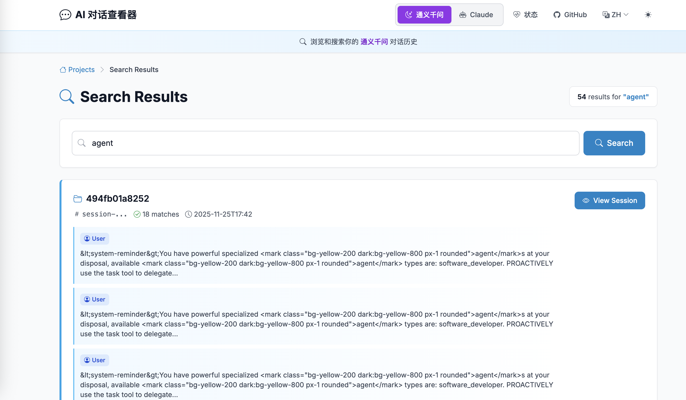

# AI 对话查看器 🔍

一个美观、统一的 Web 界面，用于浏览和搜索多个平台的 AI 对话历史记录。


## ✨ 核心特性

- 🤖 **多平台支持** - 支持 Claude Code 和通义千问对话历史
- 🔍 **强大搜索** - 全文搜索所有对话，关键词高亮显示
- 📂 **智能组织** - 按项目浏览对话，包含会话元数据和统计信息
- 💻 **语法高亮** - 精美的代码块展示，支持语言检测和一键复制
- 🎨 **现代界面** - 简洁响应式界面，支持深色/浅色主题
- 🌍 **国际化** - 多语言支持（中文/英文）
- ⚡ **高性能** - 大量对话历史的高效分页加载
- 🔧 **工具可视化** - 清晰展示工具使用和输出结果
- 📊 **交互式差异查看器** - 并排对比查看代码变更

## 🚀 快速开始

### 安装

```bash
pip install claude-code-viewer
```

### 使用方法

```bash
# 使用默认设置启动（自动查找 ~/.claude/projects）
claude-viewer

# 指定自定义 Claude 项目路径
claude-viewer --projects-path /path/to/your/claude/projects

# 自定义端口
claude-viewer --port 8080

# 允许其他机器访问
claude-viewer --host 0.0.0.0 --port 3000
```

然后在浏览器中打开：`http://localhost:6300`

## 📸 界面截图

### 主面板 - Claude 视图
浏览所有 Claude Code 项目，查看会话数量和详细统计信息。



### 主面板 - 通义千问视图
无缝切换不同 AI 平台，查看对话历史记录。



### 对话详情
查看对话内容，包含格式化、语法高亮和搜索功能。



### 全局搜索
跨所有对话和项目搜索，即时显示结果。



## 🛠️ 命令行选项

```bash
claude-viewer --help
```

**可用选项：**
- `--projects-path` - Claude 项目目录路径（默认：`~/.claude/projects`）
- `--host` - 服务器绑定地址（默认：`127.0.0.1`）
- `--port` - 运行端口（默认：`6300`）
- `--version` - 显示版本信息

## 📁 工作原理

AI 对话平台将对话历史存储在 JSONL 文件中。本工具：

1. **扫描** 您的 AI 项目目录（Claude：`~/.claude/projects/`，通义千问：本地存储）
2. **解析** 来自多个 AI 平台的 JSONL 对话文件
3. **展示** 在统一、美观的 Web 界面中
4. **支持** 跨所有对话的强大搜索和过滤功能
5. **提供** 多语言界面支持国际用户

## 🔧 开发指南

### 本地开发

```bash
git clone https://github.com/desis123/claude-code-viewer
cd claude-code-viewer
pip install -e .
claude-viewer
```

### 项目结构

```
claude-code-viewer/
├── claude_viewer/          # 主包
│   ├── cli.py             # 命令行接口
│   ├── main.py            # FastAPI 应用
│   ├── i18n.py            # 国际化支持
│   └── utils/             # 工具类（JSONL 解析器）
├── static/                # CSS、JavaScript
├── templates/             # HTML 模板
└── setup.py              # 包配置
```

## 🤝 贡献指南

欢迎贡献！请遵循以下步骤：

1. **Fork** 本仓库
2. **创建** 功能分支（`git checkout -b feature/amazing-feature`）
3. **提交** 您的更改（`git commit -m 'Add amazing feature'`）
4. **推送** 到分支（`git push origin feature/amazing-feature`）
5. **提交** Pull Request

### 开发环境设置

```bash
git clone <your-fork>
cd claude-code-viewer
pip install -e ".[dev]"
```

## 🤖 支持的 AI 平台

目前支持：
- **Claude Code** - Anthropic 官方 Claude CLI 工具
- **Qwen（通义千问）** - 阿里云 AI 助手

更多平台即将推出！

## 📋 系统要求

- **Python 3.8+**
- **AI 平台**（Claude Code、通义千问或其他支持的平台）
- **现代浏览器**（Chrome、Firefox、Safari、Edge）

## 🐛 常见问题

### "Projects path does not exist"（项目路径不存在）
确保已使用 Claude Code 并创建了对话文件。默认路径为 `~/.claude/projects`。

### "No JSONL files found"（未找到 JSONL 文件）
确保您已使用 Claude Code 并生成了对话历史。尝试使用 `--projects-path` 指定自定义路径。

### 端口已被占用
使用其他端口：`claude-viewer --port 8080`

## 📄 开源协议

Apache 2.0 License - 详见 [LICENSE](LICENSE) 文件。

## 🙏 致谢

- 使用 [FastAPI](https://fastapi.tiangolo.com/) 和 [Bootstrap](https://getbootstrap.com/) 构建
- 语法高亮由 [Pygments](https://pygments.org/) 提供
- 为 AI 开发者社区创建

## 📊 亮点

- 🎯 **零配置** - 开箱即用，无需复杂设置
- ⚡ **快速启动** - 亚秒级启动时间
- 🔍 **全文搜索** - 即时搜索所有对话
- 📱 **移动响应式** - 在所有设备上无缝运行
- 🌍 **多语言** - 支持中英文界面
- 🤖 **多平台** - 支持多个 AI 平台

## 🗺️ 开发路线图

- [ ] 支持更多 AI 平台（Cursor、Gemini 等）
- [ ] 导出对话到多种格式（PDF、Markdown、HTML）
- [ ] 高级过滤和标签系统
- [ ] 对话分析和统计
- [ ] 实时对话监控
- [ ] 程序化访问 API

---

**用 ❤️ 为 AI 开发者社区打造**

[问题反馈](https://github.com/desis123/claude-code-viewer/issues) • [功能建议](https://github.com/desis123/claude-code-viewer/issues/new) • [English Docs](README.md)
